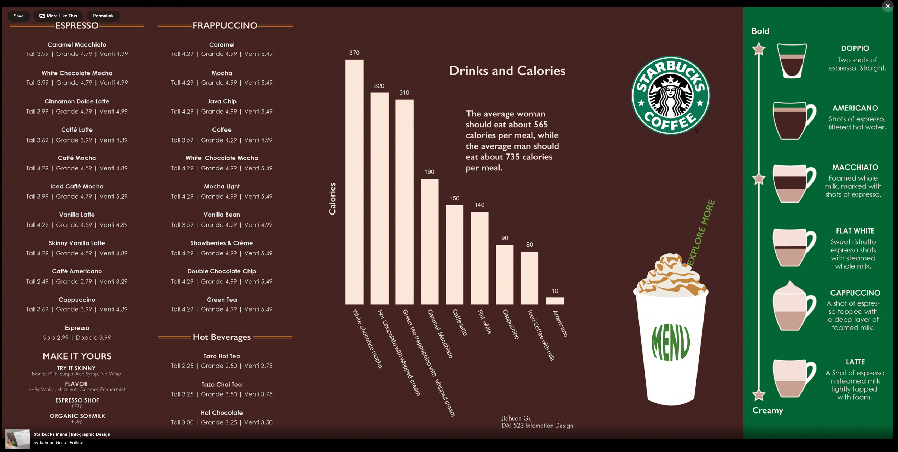

```{r setup, include=FALSE}
library(flexdashboard)
library(tidyverse)
library(naniar)
library(readr)
library(ggplot2)
library(plotly)
library(visdat)
library(dplyr)
library(tidyr)
library(reshape2)
library(fastDummies)
library(rpart)
library(rpart.plot)
library(broomstick)
library(caret)
library(formattable)
library(kableExtra)
```
```{r import data, echo = FALSE, include = FALSE}
starbucks_original <- read_csv('starbucks.csv')
```
```{r visualising original data, include = FALSE}
summary(starbucks_original)
head(starbucks_original)
```

Introduction
=======================================================================

Row{data-width = 600}
--------------------------------
### **Introduction**
**Description of data**
The data is from the Official Starbucks Nutritional Dataset from the pdf Starbucks Coffee Company Beverage Nutrition Information 2021. The dataset provided contains `r nrow(starbucks_original)` observations and `r ncol(starbucks_original)` variables. The Starbucks dataset has information that describes the nutritional information for every drink product on the starbucks menu. There are `r length(unique(starbucks_original$'product_name'))` variations of drinks in the dataset.


**Purpose of the report:**
There are two main areas that this report aims to explore. 
The two questions were:

* **Research question 1:** What is the relationship between the size of a Starbucks Drink and its nutritional content (specifically sugar and caffeine)?
    - Sub-question 1: Can the size of a Starbucks drink be predicted based on its nutritional content?
    - Sub-question 2: What can we then say about how the size of drink is related to how healthy a drink is?
* **Research question 2:** How does the nutritional information vary between different types of Starbucks drinks?
    - Sub-question 1: Can the size type of Starbucks drink be predicted using its nutritional information?

<div style="width: 600px; height: 500px; margin-top: 20px;">
  
</div>


Column {data-width=650}
-----------------------------------------------------------------------
### **Data cleaning, subsetting and tidying**
```{r cleaning data, echo = FALSE, include = FALSE}
any_na(starbucks_original) # no missing data
n_miss(starbucks_original) # no missing data

duplicates <- starbucks_original %>% filter(duplicated(starbucks_original))
duplicates # no duplicates

starbucks_original$trans_fat_g <- as.numeric(starbucks_original$trans_fat_g)
starbucks_original$fiber_g <- as.numeric(starbucks_original$fiber_g) # fixing column data types 


starbucks <- starbucks_original %>% # grouping by product name to remove size variations of same product 
    group_by(product_name) %>% 
    summarise(
        mean_milk = (mean(milk)),
        mean_calories = round(mean(calories), 2),
        mean_total_fat_g = round(mean(total_fat_g), 2),
        mean_sat_fat_g = round(mean(saturated_fat_g), 2),
        mean_trans_fat_g = round(mean(trans_fat_g, na.rm = TRUE), 2),
        mean_cholesterol_mg = round(mean(cholesterol_mg), 2),
        mean_sodium_mg = round(mean(sodium_mg), 2),
        mean_total_carbs_g = round(mean(total_carbs_g), 2),
        mean_fiber_g = round(mean(fiber_g, na.rm = TRUE), 2),
        mean_sugar_g = round(mean(sugar_g), 2),
        mean_caffeine_mg = round(mean(caffeine_mg), 2)
    ) 


starbucks <- starbucks %>%  # classifying all drink types to subset the data
    mutate(drink_type = case_when(
        grepl("tea Lemonade", product_name, ignore.case = TRUE) ~ "Other",
        grepl("Tea Lemonade", product_name, ignore.case = TRUE) ~ "Other",
        grepl("Smoothie", product_name, ignore.case = TRUE) ~ "Smoothie",
        grepl("Chai", product_name, ignore.case = TRUE) ~ "Tea",
        grepl("Tea", product_name, ignore.case = TRUE) ~ "Tea",
        grepl("tea", product_name, ignore.case = TRUE) ~ "Tea",
        grepl("Espresso", product_name, ignore.case = TRUE) ~ "Coffee",
        grepl("Latte", product_name, ignore.case = TRUE) ~ "Coffee",
        grepl("Coffee", product_name, ignore.case = TRUE) ~ "Coffee",
        grepl("coffee", product_name, ignore.case = TRUE) ~ "Coffee",
        grepl("Caffè", product_name, ignore.case = TRUE) ~ "Coffee",
        grepl("Cappuccino", product_name, ignore.case = TRUE) ~ "Coffee",
        grepl("Frappuccino", product_name, ignore.case = TRUE) ~ "Coffee",
        grepl("Macchiato", product_name, ignore.case = TRUE) ~ "Coffee",
        grepl("Flat", product_name, ignore.case = TRUE) ~ "Coffee",
        grepl("Mocha", product_name, ignore.case = TRUE) ~ "Coffee",
        grepl("Doubleshot", product_name, ignore.case = TRUE) ~ "Coffee",
        grepl("Cold brew", product_name, ignore.case = TRUE) ~ "Coffee",
        TRUE ~ "Other"
    )) 
starbucks <- starbucks %>% 
    select(product_name, drink_type, everything()) %>% 
    dummy_cols(select_columns = "drink_type")
```

The data cleaning processes carried out included:

* Check for missing values in the data (None)
* Check for duplicate entries in the data (None)
* Correcting data types of a few variables
* Grouping data by product name to remove size variation, and instead use a mean for each nutritional content variable
* Classifying data into 1 of 4 drink types (`r unique(starbucks$'drink_type')`)

The result was a neater dataset which was used for later research purposes
```{r display of starbucks cleaned}
head(starbucks, 10) %>%
kable(caption = "Starbucks cleaned sample") %>% 
kable_styling(bootstrap_options = c("hover", "striped"))
```


Research Question 1.1
================
Row {data-width=600}
------
### **Correlations of variables**
To decide which nutritional information would be most closely related to drink types, a correlation heatmap was created.
This led to three nutritional categories being chosen (Caffeine, Sugar and Calories)

```{r correlations}
variables <- starbucks[, -c(1, 2) ]
correlation <- round(cor(variables), 2) # correlation matrix

  get_upper_tri <- function(cormat){ 
    cormat[lower.tri(cormat)]<- NA
    return(cormat)
  } # function for getting upper triangle by setting lower to NA

reorder_cormat <- function(cormat){
dd <- as.dist((1-cormat)/2)
hc <- hclust(dd)
cormat <-cormat[hc$order, hc$order]
}

correlation <- reorder_cormat(correlation)
upper_tri <- get_upper_tri(correlation)
melted_correlation <- melt(upper_tri, na.rm = TRUE)
heatmap <- ggplot(melted_correlation, aes(Var2, Var1, fill = value)) +
    geom_tile(color = 'white') +
    scale_fill_gradient2(low = 'blue', high = 'red', mid = 'white',
                         midpoint = 0, limit = c(-1,1), space = 'Lab',
                         name = "Correlation") +
    theme_minimal() +
    theme(axis.text.x = element_text(angle = 45, vjust = 1,
                                     size = 8, hjust = 1)) +
    coord_fixed() +
    ggtitle("Correlation Heatmap")
heatmap
```


Row {.tabset data-height=550}
--------------------------------------------

### **1. Mean Sugar for different types of Starbucks drinks**
```{r group by drink type, include = FALSE}
drinks <- starbucks %>% 
    group_by(drink_type) %>% 
    summarise(avg_milk = (mean(mean_milk)),
        avg_calories = round(mean(mean_calories), 2),
        avg_total_fat_g = round(mean(mean_total_fat_g), 2),
        avg_sat_fat_g = round(mean(mean_sat_fat_g), 2),
        avg_trans_fat_g = round(mean(mean_trans_fat_g), 2),
        avg_cholesterol_mg = round(mean(mean_cholesterol_mg), 2),
        avg_sodium_mg = round(mean(mean_sodium_mg), 2),
        avg_total_carbs_g = round(mean(mean_total_carbs_g), 2),
        avg_fiber_g = round(mean(mean_fiber_g), 2),
        avg_sugar_g = round(mean(mean_sugar_g), 2),
        avg_caffeine_mg = round(mean(mean_caffeine_mg), 2)
    )
drinks
```

```{r sugar by type of drink box plot}
ggplot(starbucks, 
       aes(x = drink_type,
           y = mean_sugar_g,
           colour = `drink_type`,
           )) +
    labs(title = "Box plot for Mean Sugar for types of Starbucks drinks",x = "Drink type" ,y = "Mean sugar (g)") +
    theme(axis.text.x = element_text(angle = 45)) + 
    geom_boxplot()
```

### **2. Mean Calories for different types of Starbucks Drinks**
```{r Calories by type of drink box plot}
ggplot(starbucks, 
       aes(x = drink_type,
           y = mean_calories,
           colour = `drink_type`,
           )) +
    labs(title = "Box plot for Mean Calories for types of Starbucks drinks",x = "Drink type" ,y = "Mean calories") +
    theme(axis.text.x = element_text(angle = 45)) + 
    geom_boxplot()
```

### **3. Mean Caffeine for types of Starbucks drinks**
```{r Caffeine by type of drink box plot}
ggplot(starbucks, 
       aes(x = drink_type,
           y = mean_caffeine_mg,
           colour = `drink_type`,
           )) +
    labs(title = "Box plot for Mean Caffeine for types of Starbucks drinks",x = "Drink type" ,y = "Mean Caffeine (mg)") +
    theme(axis.text.x = element_text(angle = 45)) + 
    geom_boxplot()
```

Column {.sidebar data-width=350}
----
> **Relationship between type of Starbucks drink and its nutritional content**

***

> **Overview**

The basis of this investigation was to verify if and how the nutritional content varies between Starbucks Drink types.
It was decided that the analysis would look specifically into 3 nutritional aspects (Sugar (g), Caffeine (mg) and Calories).
There are 4 Starbucks Drink types (Coffee, Tea, Smoothie and Other).

***

**Observations**

1. Mean Sugar and Drink type
  * On average, Sugar is more concentrated in the drink types 'Smoothie' and 'Other' with means of around 39g and 36g respectively. 
  * Conversely, Sugar was far less in Coffee and Tea with means of around 19g and 25g respectively
  * However, there was a larger range of sugar amounts in Tea and Coffee, which could be the result of having more products which fall into that category

2. Mean Calories and Drink type
  * On average, Calories are relatively similar to each other in Coffee, Tea, and Other categories with means ranging from 100-160 calories
  * Contrasting to this, Smoothies contained much higher amounts, up to 290 calories on average
  * Again, the larger range of calories for coffee and tea categories could be the effect of having more products in these categories

3. Mean Caffeine and Drink type
* Coffee is by far the highest caffeinated drink type with an average of 140mg of Caffeine per drink. Second to this is Tea with only around 80mg of Caffeine on average
* The Smoothie and Other category average 0mg and 20mg respectively. 

**Conclusion:**

* Drink types which are more caffeinated (Coffee and Tea) seem to have an inverse relationship with the amount of sugar.
* Calories and Sugar content seem to follow the same pattern, as drink types which have higher levels of sugar also have high levels of calories (Other and Smoothie)


```{r}

```


Research Question 1.2 
==============================================================================
Row {.tabset data-height=700}
-----------------------------------------

### **Classification Tree**
```{r Predicting drink type from caffeine, sugar levels, and calories}
starbucks <- starbucks %>% 
    mutate(drink_type = factor(drink_type)) %>% 
    filter(drink_type %in% c('Coffee', 'Tea', 'Smoothie', 'Other'))


rp_drinks <- rpart(drink_type ~ mean_sugar_g + starbucks$mean_caffeine_mg + starbucks$mean_calories,
                      data = select(starbucks, `drink_type`, mean_sugar_g))
rpart.plot(rp_drinks)

```

### **Confusion matrix**
```{r Confusion matrix, include = FALSE}
drinks_aug <- augment(rp_drinks, type = "class") 

drinks_confusion_matrix <- table(drinks_aug$drink_type, drinks_aug$.fitted)
drinks_confusion_matrix_df <- as.data.frame.matrix(drinks_confusion_matrix)
colnames(drinks_confusion_matrix_df) <- c("Predicted: Coffee", "Predicted: Other", "Predicted: Smoothie", "Predicted: Tea")
rownames(drinks_confusion_matrix_df) <- c("Actual: Cofee", "Actual: Other", "Actual: Smoothie", "Actual: Tea")
```
```{r Confusion matrix cleaned display}
drinks_confusion_matrix_df %>%
kable(caption = "Confusion matrix for accuracy of model") %>% 
kable_styling(bootstrap_options = c("hover", "striped"))
```
```{r drinks accuracy calculations, include = FALSE}
drinks_accuracy = (drinks_confusion_matrix_df[1,1] + drinks_confusion_matrix_df[2,2] + drinks_confusion_matrix_df[3,3] + drinks_confusion_matrix_df[4,4]) / sum(drinks_confusion_matrix_df)

drinks_accuracy
```

Column {.sidebar data-width=350}
-----------------------------------------
***

>**Overview**

Another question which was posed by the investigation into the relationship between drink type and nutritional content was if there was a relationship,
could the type of drink be predicted by the nutritional content of a drink?
This was further looked into through a classification tree.

***

**Overall accuracy of the Classification Tree:** `r round(drinks_accuracy, 2)`

This tells us that the model is actually accurate, and the drink type of a particular drink can be determined by its nutritional information.


Research Question 2.2 
==============================================================================
```{r does size impact nutritional information, include = FALSE}
sizes <- starbucks_original %>% # grouping by size to analyse size of starbucks drinks
    group_by(size) %>% 
    summarise(
        mean_milk = round(mean(milk), 2),
        mean_serv_size_ml = round(mean(serv_size_m_l), 2),
        mean_calories = round(mean(calories), 2),
        mean_total_fat_g = round(mean(total_fat_g), 2),
        mean_sat_fat_g = round(mean(saturated_fat_g), 2),
        mean_trans_fat_g = round(mean(trans_fat_g), 2),
        mean_chol_mg = round(mean(cholesterol_mg), 2),
        mean_sodium_mg = round(mean(sodium_mg), 2),
        mean_carbs_g = round(mean(total_carbs_g), 2),
        mean_fiber_g = round(mean(fiber_g), 2),
        mean_sugar_g = round(mean(sugar_g), 2),
        mean_caffeine_mg = round(mean(caffeine_mg), 2)
    )

order = c('short', 'tall', 'grande', 'venti', 'trenta', 'Average daily intake') 

sizes <- sizes %>% 
    filter(size %in% c('short','tall','grande','venti','trenta')) %>% #only taking sizes which actually correspond to starbucks sizes
    select(c('size','mean_serv_size_ml','mean_calories', 'mean_sugar_g', 'mean_caffeine_mg')) %>% 
    arrange(factor(size, levels = order))
sizes
average_intakes <- data.frame(
  size = "Average daily intake",
  mean_serv_size_ml = NA,
  mean_calories = 2039,
  mean_sugar_g = 30,
  mean_caffeine_mg = 135
) # data frame with averages daily intake of nutritional statistics

sizes <- rbind(sizes, average_intakes)
sizes <- sizes[c(1,2,3,4,5,6), ] #added to size table for comparison
```

Row {data-width=600}
------
### **Nutritional information by Drink size**
```{r }
sizes %>%
kable(caption = "Nutritional information for Starbucks Sizes") %>% 
kable_styling(bootstrap_options = c("hover", "striped"))
```


Row {.tabset data-height=700}
-----------------------------------------
### **Bar Chart for Average Sugar content by Starbucks Drink Size**
```{r bar for sugar in each size}
sizes$size <- factor(sizes$size, levels = order)

ggplot(sizes,
       aes(x = size, y = mean_sugar_g)) +
    geom_bar(stat = "summary", fun = "mean", fill = "blue") +
    labs(x = "Drink size", y = "Average Sugar Content (g)",
         title = "Average Sugar Content by drink size")
```

### **Bar Chart for Average Caffeine content by Starbucks Drink Size**
```{r bar for caffeine in each size}
sizes$size <- factor(sizes$size, levels = order)

ggplot(sizes,
       aes(x = size, y = mean_caffeine_mg)) +
    geom_bar(stat = "summary", fun = "mean", fill = "blue") +
    labs(x = "Drink size", y = "Average Caffeine Content (mg)",
         title = "Average Caffeine Content by drink size")
```

### **Bar Chart for Average Calories for each Starbucks Drink Size**
```{r calories bar graph for sizes}
sizes$size <- factor(sizes$size, levels = order)

ggplot(sizes,
       aes(x = size, y = mean_calories)) +
    geom_bar(stat = "summary", fun = "mean", fill = "blue") +
    labs(x = "Drink size", y = "Average Calories",
         title = "Average Calories by drink size")
```

Column {.sidebar data-width=350}
-----------------------------------------
***

>**Overview**

Research question 2 looks into how the size of a Starbucks Drink relates to its nutritional contents. Does bigger size necessarily indicate larger portions of each statistic?

Starbucks has 5 drink sizes which are:
`r order[1:4]` and `r order[5]` in that order, from smallest to largest.

The decision was to investigate 3 nutritional statistics which were Sugar content, Caffeine content and number of Calories.


***

**Observations** 

* For all three nutritional statistics, the drink size was proportionate to the presence of that nutritional statistic.
    - e.g Average sugar content was around 50g for Venti size (2nd largest) and was around 14 for the Short size (smallest)
* However, the exception to this trend is the Trenta size (largest), which seems to be just lower in concentration for all 3 nutritional statistics 
    - e.g Average caffeine content was around 149mg for the Venti size (2nd largest) but was lower at around 147mg for the Trenta size (largest)
    - This could be attributed to the drink becoming more diluted with the addition of more liquid to fill a larger cup.
* **Comparison to the Average daily intake:**
    - Sugar: From the tall size upwards, the average amount of sugar in 1 drink is equal to or more than the average daily intake (Very unhealthy)
    - Caffeine: Grande, Venti and Trenta sizes are all below the Average daily intake, while Short and Tall size are below half of the average daily intake
    - Calories: All drinks sizes are well below the Average daily intake.


Research Question 2.2 
==============================================================================
Row {.tabset data-height=700}
-----------------------------------------

### **Classification Tree**
```{r proper sizes}
starbucks_original <- starbucks_original %>% filter(size %in% c('short', 'tall', 'grande', 'venti', 'trenta')) 
```
```{r decision tree to classify drink size via sugar and caffeine}
starbucks_original <- starbucks_original %>% 
    mutate(size = factor(size)) %>% 
    filter(size %in% c('short', 'tall', 'grande', 'venti', 'trenta'))

rp_starbucks <- rpart(size ~ sugar_g + starbucks_original$caffeine_mg,
                      data = select(starbucks_original, size, sugar_g))
rpart.plot(rp_starbucks, extra = 1)
```

### **Confusion matrix**

```{r accuracy of classification tree, include = FALSE}
starbucks_aug <- augment(rp_starbucks, type = "class") 

starbucks_aug %>% 
  count(size, .fitted)
```

```{r accuracy}
confusion_matrix <- table(starbucks_aug$size, starbucks_aug$.fitted)
confusion_matrix_df <- as.data.frame.matrix(confusion_matrix)
colnames(confusion_matrix_df) <- c("Predicted: Grande", "Predicted: Short", "Predicted: Tall", "Predicted: Trenta", "Predicted: Venti")
rownames(confusion_matrix_df) <- c("Actual: Grande", "Actual: Short", "Actual: Tall", "Actual: Trenta", "Actual: Venti")

confusion_matrix_df %>%
kable(caption = "Confusion matrix for accuracy of model") %>% 
kable_styling(bootstrap_options = c("hover", "striped"))
```
```{r accuracy calculations, include = FALSE}
accuracy = (confusion_matrix_df[1,1] + confusion_matrix_df[2,2] + confusion_matrix_df[3,3] + confusion_matrix_df[4,4] + confusion_matrix_df[5,5]) / sum(confusion_matrix_df)
accuracy
``` 

Column {.sidebar data-width=350}
-----------------------------------------
***

>**Overview**

Due to the clear trend in nutritional statistics for different drink sizes, a classification tree was fitted to the data to inquire into if the Size of drink could be predicted from its nutritional information (Caffeine and Sugar content). The nutritional statistic was left out from the model as it the trend with between sizes of drinks was not as clear compared to the other 2 statistics. 

***

**Overall accuracy of the Classification Tree:** `r round(accuracy, 2)`

This tells us that the model is not particularly accurate, and may require other variables which are closely related to drink size to improve the accuracy score, and correctly classify drink sizes based on nutritional information.


References
=====================================     
**Reference list**

[1] ggplot2 : Quick correlation matrix heatmap - R software and data visualization - Easy Guides - Wiki - STHDA. (n.d.). www.sthda.com. http://www.sthda.com/english/wiki/ggplot2-quick-correlation-matrix-heatmap-r-software-and-data-visualization

[2] Food Standards Australia and New Zealand. (2021, August). Caffeine. www.foodstandards.gov.au. https://www.foodstandards.gov.au/consumer/generalissues/Pages/Caffeine.aspx

[3] When it comes to reading food labels, what’s most important? | Hillcrest Hospital South in Tulsa, Oklahoma. (n.d.). Hillcrestsouth.com. https://hillcrestsouth.com/news/when-it-comes-reading-food-labels-what%E2%80%99s-most-important

[4] How to Create Cool Dashboards using R. (2021, September). www.youtube.com. Retrieved October 8, 2023, from https://www.youtube.com/watch?v=fkqD9kcvCkU

[5] Build a Dashboard in 10 Seconds with R Shiny Flexdashboard. (2018, December). www.youtube.com. Retrieved October 8, 2023, from https://www.youtube.com/watch?app=desktop&v=6WTaGEOVJ6s

[6] Confusion Matrix in R | A Complete Guide | DigitalOcean. (n.d.). Www.digitalocean.com. https://www.digitalocean.com/community/tutorials/confusion-matrix-in-r

[7] Maintainer, S., & Milborrow, S. (2020). Package “rpart.plot” Title Plot “rpart” Models: An Enhanced Version of “plot.rpart.” https://cran.r-project.org/web/packages/rpart.plot/rpart.plot.pdf

[8] Dummy Variables in R Programming. (2020, August 1). GeeksforGeeks. https://www.geeksforgeeks.org/dummy-variables-in-r-programming/

[9] Hao Zhu (2021). kableExtra: Construct Complex Table with 'kable'
  and Pipe Syntax. R package version 1.3.4.
  https://CRAN.R-project.org/package=kableExtra

[10] ggplot2 : Quick correlation matrix heatmap - R software and data visualization - Easy Guides - Wiki - STHDA. (n.d.). Www.sthda.com. http://www.sthda.com/english/wiki/ggplot2-quick-correlation-matrix-heatmap-r-software-and-data-visualization

